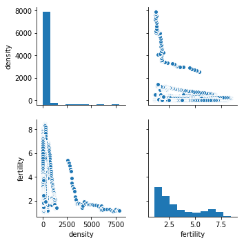
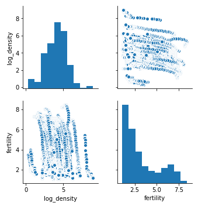
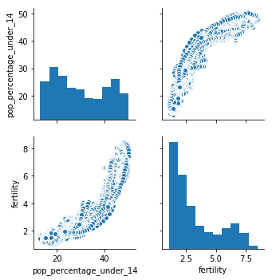
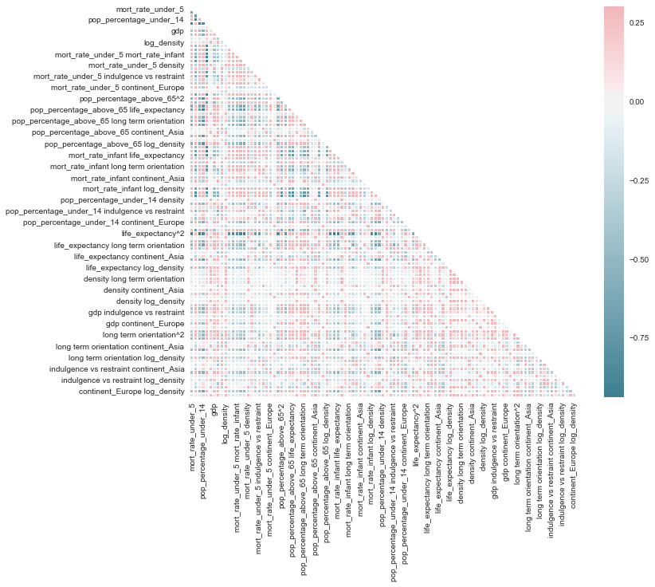
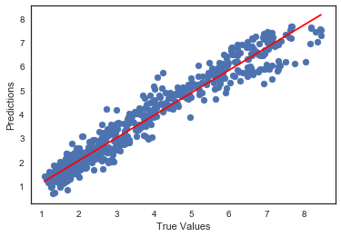

# Fertility Rate Prediction Model 

>By Tom Grigg and Erika Russi (DS-10.22.2018)

Total Fertility Rate (TFR) is defined as the "average number of children that would be born to a woman by the time
she ended childbearing if she were to pass through all her childbearing years conforming to the age-specific fertility
rates of a given year." TFR is the best single measure to compare fertility across populations. 

We built a model that predicts the TFR (births per woman) of a country in a given year. The independent variables in our model consisted of the following predictors by country and year (unless specified otherwise, all data pulled from the World Bank DataBank):
* GDP per capita (current US$)
* Population Density (people per sq. km of land area)
* Life expectancy at birth, total (years)
* Population ages 0-14 (% of total)
* Population ages 15-64 (% of total)
* Population ages 65 and above (% of total)
* Mortality rate, under-5 (per 1,000 live births)
* Mortality rate, infant (per 1,000 live births); and

From the Geert Hofstede model for Cultural Dimensions (kept constant for each country across time):
* Long Term Orientation	Index (measured 0 - 100 for each country)
* Indulgence vs. Restraint Index (measured 0 - 100 for each country)

# Preparing Data

Our data comes from two main sources: World Bank DataBank and the Geert Hofstede model for Cultural Dimensions. These two sources store elements of data that we are interested in in different ways, and excess data that needs to be trimmed and cleaned. We defined a data massaging class called Masseuse to handle this step.

### Masseuse class

The masseuse object reads in the necessary CSV files from the specified path and begins merging into the main dataframe. Data in the World Bank datasets holds feature-values for each year in columns, but we wanted this data to be indexable by country and year. We elected to reframe our data with a MultiIndex of the form (ISO-3 Country Code, Year) so that the geography was unambiguous. This involved filtering the data for overlapping regions to avoid recounting further into our analysis. 


We first import the masseuse class and tell it to construct our data.


```python
from masseuse import Masseuse

m = Masseuse(csv_dir='/Users/griggles/Documents/FLATIRON/PROJECT_2/csv/')
data = m.build_data()
```

We then build dummy variables for our categorical data. We only had one category which was datapoints continental region. We drop one of oue dummy variables from the data in order to remove initial multicollinearity. We also found multicollinearity caused by percentage of people between 15 and 64, so we dropped this too (more on this later).


```python
import pandas as pd

df = pd.get_dummies(data, columns=['continent'], drop_first=True)
df = df.drop(columns=['pop_percentage_15_to_64'])
```

# Regression


### Feature Engineering

#### Log Density

The population density data we pulled was very spread out. For instance,  in 2017 Macao has nearly 21,000 people per sq. km., while Mongolia has only 2 people per sq. km. We researched other studies on population density and realized that the convention for its analysis was to take the log of the population density. When doing this, we wouldn't need to correct for outliers like Macao because the spread of the data was reduced.


```python
import numpy as np
import seaborn as sns


df['log_density'] = np.log(df['density'])
```


```python
sns.pairplot(df, vars=['density', 'fertility'])
sns.pairplot(df, vars=['log_density', 'fertility'])
```


    <seaborn.axisgrid.PairGrid at 0x10f81e198>








```python
from matplotlib import pyplot as plt
from sklearn import datasets, linear_model
from sklearn.model_selection import train_test_split
from sklearn import metrics

features = df.iloc[:,1:]
target = df['fertility']
features.head()
```


<div>
<style scoped>
    .dataframe tbody tr th:only-of-type {
        vertical-align: middle;
    }

    .dataframe tbody tr th {
        vertical-align: top;
    }

    .dataframe thead th {
        text-align: right;
    }
</style>
<table border="1" class="dataframe">
  <thead>
    <tr style="text-align: right;">
      <th></th>
      <th></th>
      <th>mort_rate_under_5</th>
      <th>pop_percentage_above_65</th>
      <th>mort_rate_infant</th>
      <th>pop_percentage_under_14</th>
      <th>life_expectancy</th>
      <th>density</th>
      <th>gdp</th>
      <th>long term orientation</th>
      <th>indulgence vs restraint</th>
      <th>continent_Americas</th>
      <th>continent_Asia</th>
      <th>continent_Europe</th>
      <th>continent_Oceania</th>
      <th>log_density</th>
    </tr>
    <tr>
      <th>Country Code</th>
      <th>Years</th>
      <th></th>
      <th></th>
      <th></th>
      <th></th>
      <th></th>
      <th></th>
      <th></th>
      <th></th>
      <th></th>
      <th></th>
      <th></th>
      <th></th>
      <th></th>
      <th></th>
    </tr>
  </thead>
  <tbody>
    <tr>
      <th rowspan="5" valign="top">ALB</th>
      <th>1984</th>
      <td>58.2</td>
      <td>5.390937</td>
      <td>48.9</td>
      <td>34.310923</td>
      <td>71.134</td>
      <td>106.001058</td>
      <td>662.520052</td>
      <td>61.0</td>
      <td>15.0</td>
      <td>0</td>
      <td>0</td>
      <td>1</td>
      <td>0</td>
      <td>4.663449</td>
    </tr>
    <tr>
      <th>1985</th>
      <td>54.0</td>
      <td>5.399862</td>
      <td>45.7</td>
      <td>33.987349</td>
      <td>71.388</td>
      <td>108.202993</td>
      <td>662.914793</td>
      <td>61.0</td>
      <td>15.0</td>
      <td>0</td>
      <td>0</td>
      <td>1</td>
      <td>0</td>
      <td>4.684009</td>
    </tr>
    <tr>
      <th>1986</th>
      <td>50.4</td>
      <td>5.413536</td>
      <td>42.9</td>
      <td>33.709853</td>
      <td>71.605</td>
      <td>110.315146</td>
      <td>719.157296</td>
      <td>61.0</td>
      <td>15.0</td>
      <td>0</td>
      <td>0</td>
      <td>1</td>
      <td>0</td>
      <td>4.703341</td>
    </tr>
    <tr>
      <th>1987</th>
      <td>47.2</td>
      <td>5.417392</td>
      <td>40.5</td>
      <td>33.476210</td>
      <td>71.760</td>
      <td>112.540328</td>
      <td>699.384292</td>
      <td>61.0</td>
      <td>15.0</td>
      <td>0</td>
      <td>0</td>
      <td>1</td>
      <td>0</td>
      <td>4.723312</td>
    </tr>
    <tr>
      <th>1988</th>
      <td>44.5</td>
      <td>5.423440</td>
      <td>38.3</td>
      <td>33.263863</td>
      <td>71.843</td>
      <td>114.683796</td>
      <td>676.566733</td>
      <td>61.0</td>
      <td>15.0</td>
      <td>0</td>
      <td>0</td>
      <td>1</td>
      <td>0</td>
      <td>4.742179</td>
    </tr>
  </tbody>
</table>
</div>


#### Scaling 

Initially we scaled our variables in order to standardise their variance. After a few iterations of our model we noticed that our p-values were being negatively affected by this standardisation (particularly due to the presence of percentage-values in our data, i.e. pre-scaled). We decided not to standardise the data in our final OLS regression. 

### Model Selection

#### Polynomial Regression

Once we reviewed the scatterplot matrix illustrating how each variable interacted with each other, we noticed that some variables likely had a square relationship. For the preprocessing of our polynomial regression model, we generated interactive variables up to the exponential power of 2.


```python
sns.pairplot(df, vars=['pop_percentage_under_14', 'fertility'])
```


    <seaborn.axisgrid.PairGrid at 0x10ffabd30>





```python
X_train, X_test, y_train, y_test = train_test_split(features, target, random_state=32,test_size=0.2)

```


```python
from sklearn import preprocessing
from sklearn import pipeline

poly = preprocessing.PolynomialFeatures(degree=2, interaction_only=False, include_bias=False)
features_135_train = pd.DataFrame(poly.fit_transform(X_train), index=X_train.index, columns=poly.get_feature_names(X_train.columns))
features_135_test = pd.DataFrame(poly.fit_transform(X_test), index=X_test.index, columns=poly.get_feature_names(X_test.columns))
```


```python

```

### Feature Selection

#### Variance

We begun by removing low variance variables from our regression analysis - due to the differing scales of our independent variables this required us to standardise our variable matrix so that variance could be compared. We removed all variables whose standardised variance fell below our threshold of 0.5.


```python
from sklearn.feature_selection import VarianceThreshold

thresholder = VarianceThreshold(threshold=.5)

def variance_threshold_selector(data, threshold=0.5):
    selector = VarianceThreshold(threshold)
    selector.fit(data)
    return data[data.columns[selector.get_support(indices=True)]]

features_selected_train = variance_threshold_selector(features_135_train)
```

#### Correlation

After reviewing our correlation matrix (visualized as a heat map), we removed any variables with a collinearity above .95 (i.e. any predictors that were highly correlated with each other). Doing so also assisted us with reducing collinearity which could make our estimates very sensitive to slight changes in our model.

#### Multi-collinearity

After doing initial runs of our model, we noticed that the parameter 'Population ages 15-64 (% of total)' was tainting the probability value of other variables with which it was interacting. We surmised that this population metric was highly correlated with the other two percentage-based population metrics, so we ultimately removed it from the analysis. Once we did so, the p-values were below the .05 threshold for a 95% confidence level.


```python
import seaborn as sns

sns.set(style="white")


# Compute the correlation matrix
corr = features_selected_train.corr()

# Generate a mask for the upper triangle
mask = np.zeros_like(corr, dtype=np.bool)
mask[np.triu_indices_from(mask)] = True

# Set up the matplotlib figure
f, ax = plt.subplots(figsize=(11, 9))

# Generate a custom diverging colormap
cmap = sns.diverging_palette(220, 10, as_cmap=True)

# Draw the heatmap with the mask and correct aspect ratio
sns.heatmap(corr, mask=mask, cmap=cmap, vmax=.3, center=0,
            square=True, linewidths=.5, cbar_kws={"shrink": 1})
```


    <matplotlib.axes._subplots.AxesSubplot at 0x1a1c4e28d0>





```python
def calculate_cols_to_drop(upper):
    #to_drop = [column for column in upper.columns if any(upper[column] > 0.95)]
    shape = upper.shape
    print(shape)
    row_index = upper.index
    col_index = upper.columns
    to_drop = []
    
    for row in range(0, shape[0]):
        for col in range(0, shape[1]):
            #print(upper.iloc[row,col])
            if upper.iloc[row, col] > 0.95:
                if row_index[row] in to_drop or col_index[col] in to_drop:
                    pass
                else:
                    to_drop.append(col_index[col])
    return to_drop
```


```python
# Create correlation matrix
corr_matrix = features_selected_train.corr().abs()

# Select upper triangle of correlation matrix (so as not to include self-correlations of 1)
upper = corr_matrix.where(np.triu(np.ones(corr_matrix.shape), k=1).astype(np.bool))

# Find index of feature columns with correlation greater than 0.95
to_drop = [column for column in upper.columns if any(upper[column] > 0.95)]

features_selected_train.drop(columns=to_drop, inplace=True)
```

### Training Iterations

#### First Attempt


```python
from sklearn.feature_selection import SelectKBest
from sklearn.feature_selection import f_regression, mutual_info_regression

def information_selector(X, y, scoring, k=5):
    selector = SelectKBest(score_func=scoring, k=k)
    selector.fit(X, y)
    return X[X.columns[selector.get_support(indices=True)]]

test = SelectKBest(score_func=mutual_info_regression, k=30)
fit = test.fit(features_selected_train, y_train)

features_selected_train = information_selector(features_selected_train, y_train, mutual_info_regression, k=30)


```


```python
lm = linear_model.LinearRegression(fit_intercept=True)
model = lm.fit(features_selected_train, y_train)

import statsmodels.api as sm
import pylab
import statsmodels.formula.api as smf

est = sm.OLS(y_train, features_selected_train)
est2 = est.fit()
hi_p = est2.pvalues
p_limit = 0.05
hi_p = hi_p[hi_p > p_limit]
print(hi_p.index.tolist())
```

    ['long term orientation', 'mort_rate_under_5^2', 'mort_rate_under_5 pop_percentage_above_65', 'mort_rate_under_5 density', 'mort_rate_under_5 long term orientation', 'mort_rate_under_5 indulgence vs restraint', 'pop_percentage_under_14 continent_Europe', 'long term orientation indulgence vs restraint']


#### Rejecting Null Hypotheses: Dropping High P-Vals to improve model


```python
#RETRAIN WITH DROPPED HIGH P_VALUES
features_selected_train = features_selected_train.drop(columns=hi_p.index.tolist())
```

## Final Model 


```python
#NEW MODEL

test = SelectKBest(score_func=mutual_info_regression, k='all')
fit = test.fit(features_selected_train, y_train)

features_selected_train = information_selector(features_selected_train, y_train, mutual_info_regression, k='all')

# fit a model
lm2 = linear_model.LinearRegression(fit_intercept=True)
model2 = lm2.fit(features_selected_train, y_train)

features_selected_test = features_135_test[features_selected_train.columns]
y_pred = lm2.predict(features_selected_test)

print('Absolute Error: ', metrics.mean_absolute_error(y_test, y_pred))
print('Squared Error: ', metrics.mean_squared_error(y_test, y_pred))
print('Root Squared Error: ', np.sqrt(metrics.mean_squared_error(y_test, y_pred)))

from matplotlib import pyplot as plt

plt.scatter(y_test, y_pred)

plt.xlabel('True Values')
plt.ylabel('Predictions')
plt.plot(np.unique(y_test), np.poly1d(np.polyfit(y_test, y_pred, 1))(np.unique(y_test)), color='r')

```

    Absolute Error:  0.30255669762836795
    Squared Error:  0.1742911858907531
    Root Squared Error:  0.4174819587607985


    [<matplotlib.lines.Line2D at 0x1c1fa6f048>]





```python
est3 = sm.OLS(y_train, features_selected_train)
est4 = est3.fit()
print(est4.summary())
```

                                OLS Regression Results                            
    ==============================================================================
    Dep. Variable:              fertility   R-squared:                       0.988
    Model:                            OLS   Adj. R-squared:                  0.988
    Method:                 Least Squares   F-statistic:                 1.197e+04
    Date:                Fri, 07 Dec 2018   Prob (F-statistic):               0.00
    Time:                        14:33:47   Log-Likelihood:                -1613.9
    No. Observations:                3136   AIC:                             3272.
    Df Residuals:                    3114   BIC:                             3405.
    Df Model:                          22                                         
    Covariance Type:            nonrobust                                         
    ===================================================================================================================
                                                          coef    std err          t      P>|t|      [0.025      0.975]
    -------------------------------------------------------------------------------------------------------------------
    mort_rate_under_5                                  -0.0046      0.001     -5.785      0.000      -0.006      -0.003
    pop_percentage_above_65                             0.1874      0.020      9.468      0.000       0.149       0.226
    pop_percentage_under_14                             0.2822      0.009     29.990      0.000       0.264       0.301
    life_expectancy                                    -0.0246      0.005     -5.202      0.000      -0.034      -0.015
    gdp                                              9.798e-06   2.04e-06      4.808      0.000     5.8e-06    1.38e-05
    indulgence vs restraint                            -0.0290      0.004     -6.515      0.000      -0.038      -0.020
    log_density                                        -1.4751      0.112    -13.141      0.000      -1.695      -1.255
    mort_rate_under_5 log_density                       0.0032      0.000     16.397      0.000       0.003       0.004
    pop_percentage_above_65 pop_percentage_under_14    -0.0045      0.000    -10.842      0.000      -0.005      -0.004
    pop_percentage_above_65 long term orientation      -0.0005      0.000     -4.310      0.000      -0.001      -0.000
    pop_percentage_above_65 indulgence vs restraint     0.0008      0.000      4.168      0.000       0.000       0.001
    pop_percentage_above_65 log_density                -0.0109      0.003     -3.829      0.000      -0.016      -0.005
    pop_percentage_under_14 life_expectancy            -0.0011      0.000     -6.530      0.000      -0.001      -0.001
    pop_percentage_under_14 long term orientation      -0.0005   3.76e-05    -12.921      0.000      -0.001      -0.000
    pop_percentage_under_14 indulgence vs restraint     0.0002    8.2e-05      2.680      0.007     5.9e-05       0.000
    pop_percentage_under_14 log_density                -0.0055      0.001     -4.082      0.000      -0.008      -0.003
    life_expectancy log_density                         0.0161      0.001     11.281      0.000       0.013       0.019
    density continent_Europe                           -0.0002   8.61e-05     -2.188      0.029      -0.000   -1.95e-05
    gdp long term orientation                       -1.939e-07   3.76e-08     -5.161      0.000   -2.68e-07    -1.2e-07
    long term orientation log_density                   0.0040      0.000     12.421      0.000       0.003       0.005
    indulgence vs restraint log_density                 0.0037      0.000      9.033      0.000       0.003       0.004
    continent_Europe log_density                        0.0604      0.008      7.989      0.000       0.046       0.075
    ==============================================================================
    Omnibus:                      253.354   Durbin-Watson:                   2.054
    Prob(Omnibus):                  0.000   Jarque-Bera (JB):             1086.426
    Skew:                           0.281   Prob(JB):                    1.22e-236
    Kurtosis:                       5.828   Cond. No.                     1.55e+07
    ==============================================================================
    
    Warnings:
    [1] Standard Errors assume that the covariance matrix of the errors is correctly specified.
    [2] The condition number is large, 1.55e+07. This might indicate that there are
    strong multicollinearity or other numerical problems.


```python
import plotly.plotly as py
import plotly.graph_objs as go

plot = [go.Bar(
            x=est4.params.index,
            y=est4.params.values
    )]

py.iplot(plot)
```


<iframe id="igraph" scrolling="no" style="border:none;" seamless="seamless" src="https://plot.ly/~tmgrgg/26.embed" height="525px" width="100%"></iframe>


```python

```
